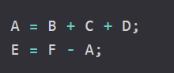
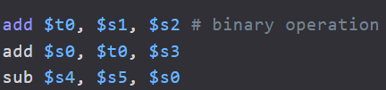
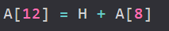
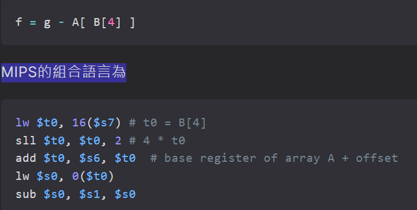

https://hackmd.io/@HsuChiChen/computer_organization
# Alignment 對齊

# 記憶體放置方法
### Big Endian 
從最左邊 權重最重(MSB)  
被放置 最低Memory Address 

# operation -> 算數指令
C語言

===================

===================
